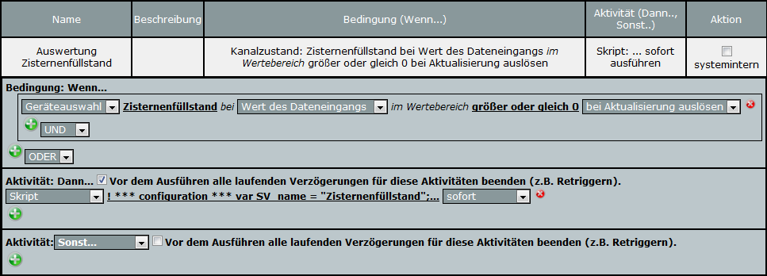

# HomeMatic 4 bis 20 mA Stromsignaleingang

Mit zwei fertigen Modulen und ein paar Elektronikbauteilen kann ein [4 bis 20 mA Stromsignaleingang](https://de.wikipedia.org/wiki/Einheitssignal) für das [Hausautomationssystem HomeMatic](http://www.homematic.com/) realisiert werden. Viele in der Industrie eingesetzte Sensoren verwenden dieses Einheitssignal zur Übermittlung ihres Messwertes, sodass vielfältigste Sensoren (z.B. Bodenfeuchte, pH, Chlor, Füllstand, Druck) in die Hausautomatisierung integriert werden können.

## Details

Der Messwert wird als 4 bis 20 mA Einheitssignal vom Messwertumformer angeliefert. Das Stromsignal wird durch einen Widerstand (47 Ohm) in eine Spannung (0 bis 1.1V) umgewandelt. Diese wird vom Analog-Digital-Konverter des Arduinos in ein Zahlenwert (0 bis 1023) konvertiert. Nach Prüfung der Gültigkeit (z.B. Messbereichsgrenzen) wird der Analogwert auf einen Zahlenbereich von 0 bis 254 abgebildet. Alle Fehler werden auf den Zahlenwert 255 abgebildet. Dieser Zahlenwert wird dann binär über 8 Leitungen an das HomeMatic HM-MOD-EM-8Bit zur Übertragung an die CCU weitergegeben.

In der CCU werden durch ein Programm die auf Kanal 3 des HM-MOD-EM-8Bit angelieferten Zahlenwerte auf den physikalischen Messbereich (z.B. Füllstand in Metern) umgerechnet und in eine Systemvariable geschrieben.

## Bauteileliste

* Arduino Nano V3
* HomeMatic 8-bit Sendemodul (HM-MOD-EM-8Bit)
* 24V-Netzteil, min. 200 mA
* Diode 1A (z.B. 1N4004)
* Elektrolytkondensator 220 µF / 35 V
* 3 Stk. Kondensatoren 100 nF
* Spannungsregler 7812
* 2 Stk. 2-polige Schraubklemmen
* Selbstrückstellende Sicherung 100 mA oder Feinsicherung 100 mA flink 5 x 20 mm mit Halter
* Widerstand 47 Ohm / 1W / 2%
* Widerstand 4,7 kOhm
* Zenerdiode 3,3 V / 1W
* Lochrasterplatine (o.ä.) oder Experimentier-Steckboard 640/200 

## Schaltung

Der Schaltplan ist in folgender Abbildung zu sehen:


Ein prototypischer Aufbau ist auf dem folgenden Bild zu sehen:


## Programmierung Arduino Nano

Die Programmierung des Arduino Nano erfolgt über [Visual Studio Code](https://code.visualstudio.com/) mit der Erweiterung [PlatformIO](https://platformio.org/).

Die Quelldatei [src/main.cpp](src/main.cpp) ist entsprechend dem Anwendungsfall zu konfgurieren und das Projekt auf den Arduino Nano zu laden.

### Konfiguration

Am Anfang der Quelldatei befinden sich etliche Konfigurationsoptionen. Folgende Optionen müssen gegebenenfalls für die eigene Anwendung angepasst werden:

|Name|Einheit|Standardwert|Bedeutung|
|---|---|---|---|
|LOOP_CURRENT_MIN|mA|2,0 (inkl. 12,5% Messbereichsunterschreitung)|Minimal zu messender Strom vom Sensor; Sendewert 0|
|LOOP_CURRENT_MAX|mA|22,0 (inkl. 12,5% Messbereichsüberschreitung)|Maximal zu messender Strom vom Sensor; Sendewert 254|
|SEND_INTERVAL_MIN|s|60|Minimales Sendeintervall; Dies beschränkt den Duty Cycle, wenn sich der Messwert häufig ändert.|
|NUM_SAMPLES|-|8|Durch mehrere AD-Konvertierungen wird das Rauschen vermindert.|

## Projektierung CCU

### Konfiguration Sendemodul

Das Sendemodul muss wie folgt eingestellt werden:


Der Kanal 3 vom Sendemodul muss wie folgt eingestellt werden:


Falls der Arduino an den Eingängen _INL1_ bis _INL8_ angeschlossen worden ist, so sind alle Häkchen bei **Dateneingang invertieren** zu entfernen.

Falls für das Trigger-Signal der Pin _DU30_ vom Homematic-Modul verwendet wird, ist die **Datenübertragungsbedingung** auf **Modus 2** zu setzen.

### Systemvariable

Folgende Systemvariable ist anzulegen. Der Name und der Wertebereich sind anzupassen:


### Programm

In der CCU ist folgendes Programm für die Messwertauswertung zu erstellen:



Im Dann-Zweig ist ein Skript einzutragen. Mindestens folgende Optionen sind dem Anwendungsfall entsprechend anzupassen:

|     Name     | Bedeutung                                                                |
|:------------:|:-------------------------------------------------------------------------|
| SV_name      | Name der Systemvariable (s.a. voriger Abschnitt)                         |
| M_rangeBegin | Messbereichsanfang der Sonde (Messwert bei einem Ausgangsstrom von 4 mA) |
| M_rangeEnd   | Messbereichsende der Sonde (Messert bei einem Ausgangsstrom von 20 mA)   |


Beispiel-Skript für eine Füllstandsmessung von 0 m bis 5 m:
```
! *** configuration ***

var SV_name = "Zisternenfüllstand"; ! system variable name
var SV_precision = 3;               ! number of decimal digits for rounding

var M_rangeBegin = 0.0; ! measurment value at 4.0 mA
var M_rangeEnd = 5.0;   ! measurement value at 20.0 mA
var M_error = -100.0;   ! replacement value for invalid measurements

var I_rangeBegin = 4.0; ! [mA]
var I_rangeEnd = 20.0;  ! [mA]

var I_min = 2.0;  ! LOOP_CURRENT_MIN in main.cpp
var I_max = 22.0; ! LOOP_CURRENT_MAX in main.cpp

! *** do not change the following lines ***

var k = (M_rangeEnd - M_rangeBegin) / (I_rangeEnd - I_rangeBegin);
var M_max = ((I_max - I_rangeBegin) * k) + M_rangeBegin;
var M_min = ((I_min - I_rangeBegin) * k) + M_rangeBegin;

var sv = dom.GetObject(ID_SYSTEM_VARIABLES).Get(SV_name); 
var src = dom.GetObject("$src$");
if (sv && src) {
    var val = src.State();
    if (val == 255) {
      sv.State(M_error);
    } else {
      val = (((M_max - M_min) * val) / 254.0) + M_min;
      sv.State(val.Round(SV_precision));
    }
}
```

Eine ungültige Messung kann bei Bedarf auch anders behandelt werden. Anstatt `sv.State(M_error);` kann eine beliebige andere Aktion ausgeführt werden. Beispiele:
* Ungültige Messung ignorieren.
* Alarmvariable setzen.

## Fehlersuche

### Diagnose-LED

Nach jeder Messung wird über die LED des Arduino Nano ein Status ausgegeben:

| Anzahl | Bedeutung |
|:-:|:--|
| 1 | Das minimale Sendeintervall ist noch nicht erreicht. |
| 2 | Der ADC-Wert liegt innerhalb des Deltas und wird nicht gesendet. |
| 3 | Der Sendewert hat sich nicht geändert. |
| 4 | Ein neuer Messwert wurde gesendet. |

### Debug-Meldungen

Debug-Meldungen werden über die serielle Schnittstelle bzw. dem USB-Port gesendet. In *PlatformIO* können über den *Serial Monitor* die Meldungen angezeigt werden.

## Ideen

Folgende Ideen für Erweiterungen und Anpassungen existieren bereits:
* Erhöhung des Shunt-Widerstandes von 47 Ohm auf 150 Ohm und Umstellung der ADC-Referenzspannung von 1,1 V auf 3,3 V. Dies verringert das Rauschen des Messwertes. Allerdings sollte vorab geprüft werden, ob der eingesetzte Sensor mit der verringerten Restspannung (ca. 20V) noch sicher betrieben werden kann.

## Unterstützung

Fragen zum Projekt können im [HomeMatic-Forum](https://homematic-forum.de) gestellt werden.

##  Lizenz und Haftungsausschluss

Dieses Projekt steht unter folgender Lizenz: \
[](http://creativecommons.org/licenses/by-sa/4.0/) \
[Creative Commons Namensnennung - Weitergabe unter gleichen Bedingungen 4.0 International Lizenz](http://creativecommons.org/licenses/by-sa/4.0/)
